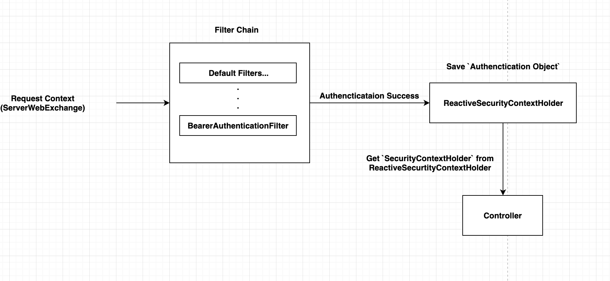
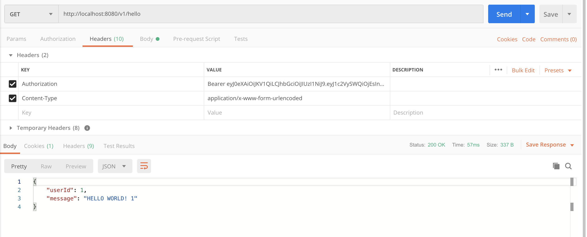

## Spring webflux JWT example


this is spring webflux jwt token example. 

I was inspired by the git hub project below.

`
https://github.com/raphaelDL/spring-webflux-security-jwt
`

I referenced the project above to make a JWT token custom filter, and added an example of extracting tokens from Route.


### Library Dependencies

```aidl
<dependencies>
        <dependency>
            <groupId>org.springframework.boot</groupId>
            <artifactId>spring-boot-starter-webflux</artifactId>
        </dependency>
        <dependency>
            <groupId>org.springframework.boot</groupId>
            <artifactId>spring-boot-starter-security</artifactId>
        </dependency>
        <dependency>
            <groupId>org.springframework.boot</groupId>
            <artifactId>spring-boot-starter-test</artifactId>
            <scope>test</scope>
        </dependency>
        <!-- jwt token auth support library -->
        <dependency>
            <groupId>com.auth0</groupId>
            <artifactId>java-jwt</artifactId>
            <version>3.8.0</version>
        </dependency>
        <dependency>
            <groupId>org.projectlombok</groupId>
            <artifactId>lombok</artifactId>
            <version>1.18.4</version>
            <scope>provided</scope>
        </dependency>
    </dependencies>
```


### JWT token payload

```aidl
{
  "type": "accessToken"
  "userId": 1,
}
```

### Jwt Token Extraction Process




### Result iamge

If the access token is valid, extract the ID from the token and respond.



